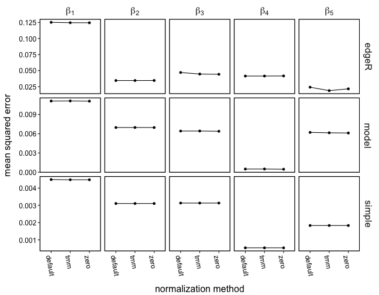
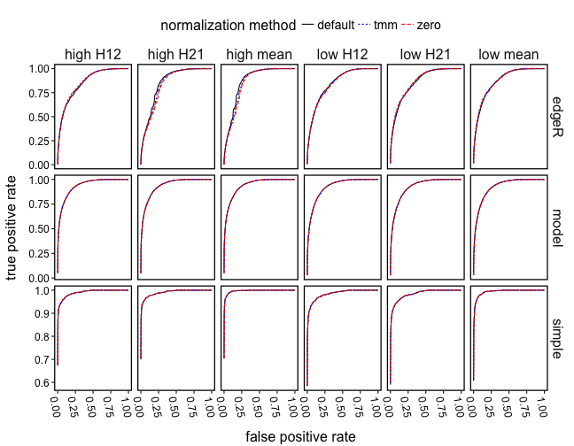
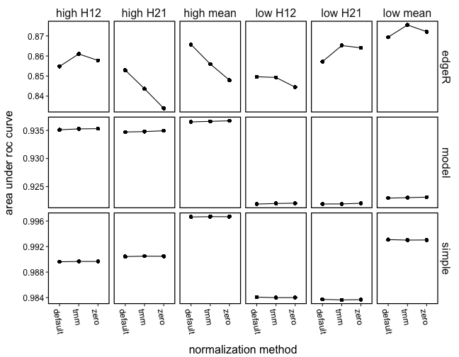
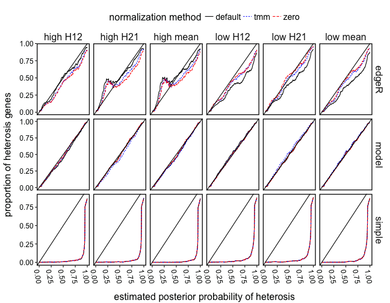
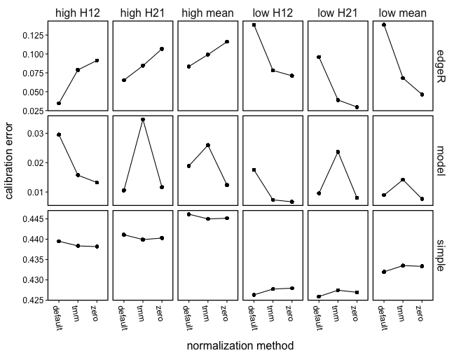

```r
library(workflowHelper)
```

```
## Loading required package: parallelRemake
```

```r
recall("psrf")
```

```
## $edgeR_default
## beta_2_13806  gamma_13806 beta_1_13806 beta_3_13806 
##     5.938061     2.334269     1.532077     1.197605 
## 
## $edgeR_tmm
## named numeric(0)
## 
## $edgeR_zero
## named numeric(0)
## 
## $model_default
##   beta_1_838 beta_1_15685 
##     1.495392     1.126746 
## 
## $model_tmm
## beta_1_838 
##   1.260179 
## 
## $model_zero
## beta_1_838 
##   1.347429 
## 
## $simple_default
## named numeric(0)
## 
## $simple_tmm
## named numeric(0)
## 
## $simple_zero
## named numeric(0)
```


```r
plot_mse(recall("mse"))
```




```r
plot_roc(recall("roc"))
```




```r
plot_auc(recall("roc"))
```




```r
plot_calibration(recall("calibration"))
```




```r
plot_cal_error(recall("calibration"))
```


